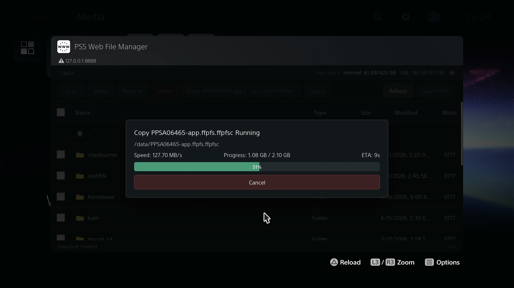
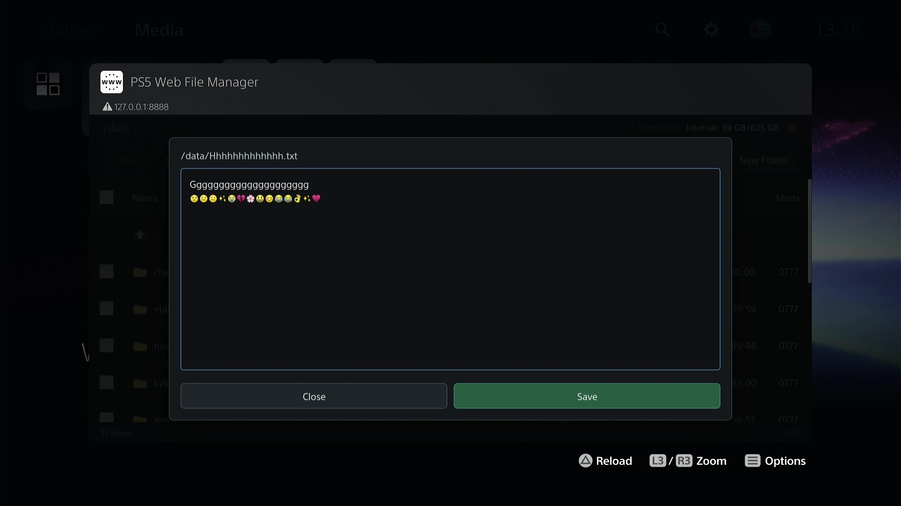
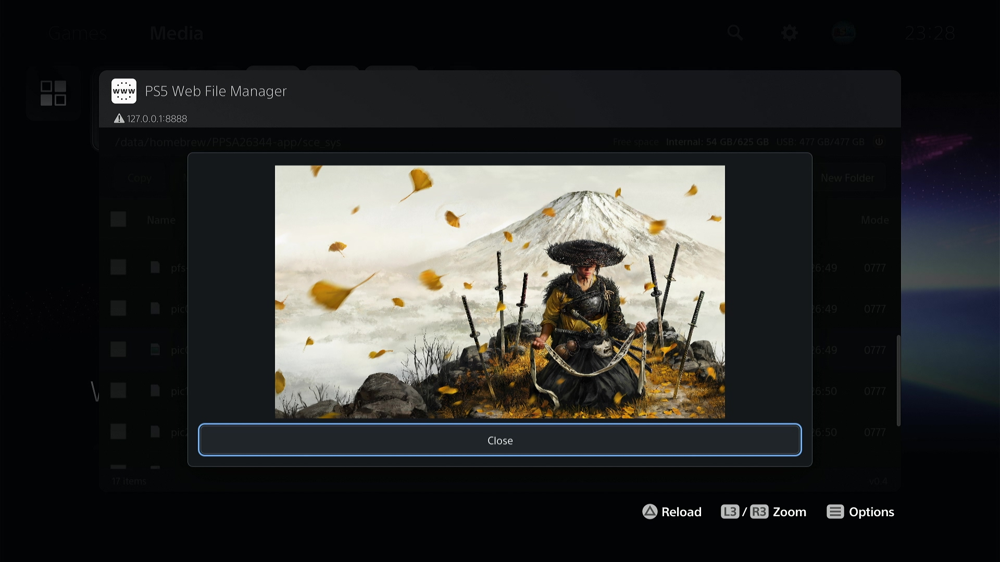

# PS5 Web File Manager

A file manager for PS5 with a web UI. It is primarily intended for quickly and
safely copying game dump folders from USB storage to internal storage.

## Brief

PS5 web file manager payload. It runs an HTTP UI starting at port `8888`, installs a home screen launcher in the Media category on startup when needed, and provides file operations from the PS5 browser or another browser on the same network. If `8888` is already in use, the payload tries the next port until one is available; the startup notification shows the actual listen port.

## Screenshots

<p>
  <a href="docs/screenshots/20260617_231827.376.jpg" target="_blank"></a>
  <a href="docs/screenshots/20260619_131432.399.jpg" target="_blank"></a>
  <a href="docs/screenshots/20260617_232348.855.jpg" target="_blank"></a>
  <a href="docs/screenshots/20260619_131811.644.jpg" target="_blank"></a>
  <a href="docs/screenshots/20260619_131535.239.jpg" target="_blank"></a>
  <a href="docs/screenshots/20260620_232728.533.jpg" target="_blank"></a>
</p>

## Features

- List files and folders.
- Sort the list by name, type, size, modified time, or permissions. The selected sort mode is saved in browser local storage.
- Change read/write/execute permissions from the permissions column, using checkboxes or a validated four-digit octal mode.
- Copy, move, delete, rename, create files, and create folders.
- Edit UTF-8 text files up to 1 MiB using the built-in plain text editor.
- Multi-select operations.
- Copy/move by choosing sources first, then pasting or moving them into the current folder.
- Conflict prompts for overwriting files and merging folders.
- Upload files or folders from a remote browser. Upload is hidden in the PS5 browser because it is intended for another device on the network.
- Download a single file directly, or download folders/multiple selections as a `.tar` archive. Download is hidden in the PS5 browser.
- Full-screen task overlay with delayed display, progress, speed, ETA, cancel support, and task recovery after reopening the browser while the payload process is still running.
- Copied/moved files and folders are set to `0777` where the filesystem supports Unix permissions. FAT/exFAT-style filesystems may ignore chmod.
- Uploaded files are written through temporary files and are renamed into place after the upload completes.
- Chinese and English UI. The browser language is read from `navigator.languages` / `navigator.language`; Chinese uses `zh`, everything else uses English.
- Responsive layout for narrow mobile browsers, including wrapped toolbars and horizontally scrollable file lists.
- Startup notification showing the app name, version, and listen port.
- Home screen launcher icon and browser favicon use the same embedded `icon0.png` data in the PS5 build to avoid storing the icon twice in the ELF.
- Create/edit text files ending with `.txt`, `.json`, `.xml`, `.ini`, `.cfg`, `.conf`, `.md`, `.log`, `.lua`, `.js`, `.css`, `.html`, `.htm`, `.c`, `.h`, `.cpp`, `.hpp`, `.sh`, `.csv`, `.yaml`, `.yml`, `.shn`.
- Preview image files ending with `.png`, `.jpg`, `.jpeg`, `.gif`, `.bmp`, `.webp`.
- Install/Preview PKG files ends with `.pkg`.

## Build

It depends on PS5 payload SDK first: [ps5-payload-dev/sdk](https://github.com/ps5-payload-dev/sdk#quick-start)

```sh
export PS5_PAYLOAD_SDK=/opt/ps5-payload-sdk
```

This project links against `libmicrohttpd`. `make` checks for it before building and runs the installer script automatically if it is missing:

```sh
make
```

If the build host has no network access, download the libmicrohttpd source tarball yourself and run the dependency installer once:

```sh
LIBMICROHTTPD_TARBALL=/path/to/libmicrohttpd-1.0.1.tar.gz \
  ./install-libmicrohttpd.sh
```

Then build again:

```sh
make
```

The output is:

```text
web-file-mgr.elf
```

For local browser/UI testing on Linux:

```sh
make linux
./web-file-mgr-linux
```

The Linux build does not include the PS5 home screen installer.

## Usage

Start an ELF loader on the PS5. The common listener port is `9021`.

Send the built payload with netcat or NetCat GUI:

```sh
export PS5_HOST=ps5_ip_address
nc -q0 "$PS5_HOST" 9021 < web-file-mgr.elf
```

After the payload starts, the PS5 notification shows the app name, version, and actual listen port. Open the shown URL in the PS5 browser, for example:

```text
http://${PS5_IP_ADDRESS}:8888/
```

On first startup the payload installs a `PS5 Web File Manager` web shortcut in the Media category when needed. Existing installed launcher files are not overwritten; missing launcher files are written and then the install step is triggered. If the payload had to use a fallback port such as `8889`, use the port shown in the startup notification.

## Notes

- Copy, move, delete, upload, and download run as single background tasks. While one task is running, other file operations are rejected.
- Delete is recursive and permanent. There is no recycle bin.
- Copy/move tasks can be canceled. A partially copied single file is removed, but partially copied folders are left in place to avoid deleting existing files when merging into an existing target folder.
- Upload tasks can be canceled. A partially uploaded temporary file is removed when possible.
- Downloading a folder or multiple selected items produces a tar stream. The tar archive is generated by the payload and is not written to PS5 storage first.
- The UI can recover the active task display if the browser is closed and reopened while the payload process is still running.
- Text editing is limited to common text-file extensions. Non-UTF-8 and oversized files are rejected.
- File names are transmitted as UTF-8 through the web API. The payload also attempts to preserve legacy byte-oriented names returned by mounted filesystems so mixed USB filename encodings can still be displayed and operated on.

## FAQ
- This is a homebrew app and should not intentionally modify system processes or kernel memory. If a kernel panic happens, make sure you are using a recent jailbreak method and ELF loader, or switch back to the stable method you normally use.
- If you are using P2JB and this payload causes a kernel panic, avoid using it with that setup. Stability matters more than convenience when each retry takes a long time.
- The preparing stage may calculate folder size and check available space. It can be slow when a folder contains many files, but it helps prevent starting a copy, move, upload, or download operation that cannot be completed safely.

## Credits

This project was built with reference to these projects:

- **[ps5-payload-dev/websrv](https://github.com/ps5-payload-dev/websrv):** HTTP server structure, static asset embedding ideas, PS5 browser/websrv behavior and PKG install function. License: GPLv3+.
- **[ps5-payload-dev/ftpsrv](https://github.com/ps5-payload-dev/ftpsrv):** PS5 payload conventions, home screen launcher/install flow reference, process handling style and startup installation reference. License: GPLv3+.
- **[seregonwar/zftpd](https://github.com/seregonwar/zftpd):** PS5 TCP socket buffer tuning and high-throughput transfer behavior reference. License: MIT.
- **[itsPLK/ps5-payload-manager](https://github.com/itsPLK/ps5-payload-manager):** Payload building behavior. License: GPLv3.
- **[libmicrohttpd](https://ftp.gnu.org/gnu/libmicrohttpd/):** Used as the embedded HTTP server library. It is licensed by GNU under the LGPL; this payload links it as the SDK-provided static library.
- **[ps5-payload-dev/sdk](https://github.com/ps5-payload-dev/sdk):** Payload building foundation. License: GPLv3+.
- **[etaHEN](https://github.com/etaHEN/etaHEN):** ShellUI URI navigation used to return to the PS5 home screen before exit. License: GPLv3.
- **[ezremote](https://github.com/cy33hc/ps5-ezremote-client):** Preview PKG info. License: GPLv2.

## License

The project is distributed under GPLv3 or later, matching the GPLv3+ projects used as implementation references. See `LICENSE`.

Third-party projects retain their own licenses. Do not copy assets or source from the credited projects into another distribution without preserving the corresponding license notices.

If distributing binaries, comply with the LGPL terms for libmicrohttpd in addition to this project's GPL license.
